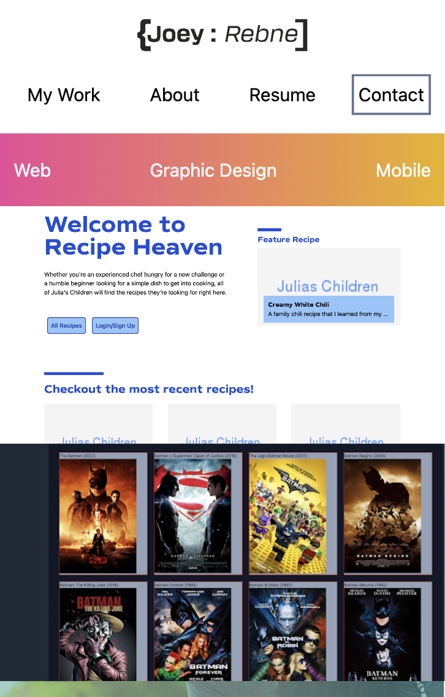

# My Portfolio (Built with React)

This project was bootstrapped with [Create React App](https://github.com/facebook/create-react-app).

## Table of Contents

- [Description](#description)
- [License](#license)

## Preview

## Description

My updated portfolio built with React. Not only does this portfolio hold my web development projects, but also my graphic design and mobile design projects. Here you can find my projects and get in touch with me for any work or projects you need help with!

## Deployed Application

[My Portfolio](https://j0j0c0ding.github.io/joeyrebne-portfolio/)

## License

### MIT

#### Copyright (c) [2022] [Joey Rebne]

##### Permission is hereby granted, free of charge, to any person obtaining a copy of this software and associated documentation files (the "Software"), to deal in the Software without restriction, including without limitation the rights to use, copy, modify, merge, publish, distribute, sublicense, and/or sell copies of the Software, and to permit persons to whom the Software is furnished to do so, subject to the following conditions:

##### The above copyright notice and this permission notice shall be included in all copies or substantial portions of the Software.

##### THE SOFTWARE IS PROVIDED "AS IS", WITHOUT WARRANTY OF ANY KIND, EXPRESS OR IMPLIED, INCLUDING BUT NOT LIMITED TO THE WARRANTIES OF MERCHANTABILITY, FITNESS FOR A PARTICULAR PURPOSE AND NONINFRINGEMENT. IN NO EVENT SHALL THE AUTHORS OR COPYRIGHT HOLDERS BE LIABLE FOR ANY CLAIM, DAMAGES OR OTHER LIABILITY, WHETHER IN AN ACTION OF CONTRACT, TORT OR OTHERWISE, ARISING FROM, OUT OF OR IN CONNECTION WITH THE SOFTWARE OR THE USE OR OTHER DEALINGS IN THE SOFTWARE.

[joey rebne]: https://github.com/J0J0C0DING
